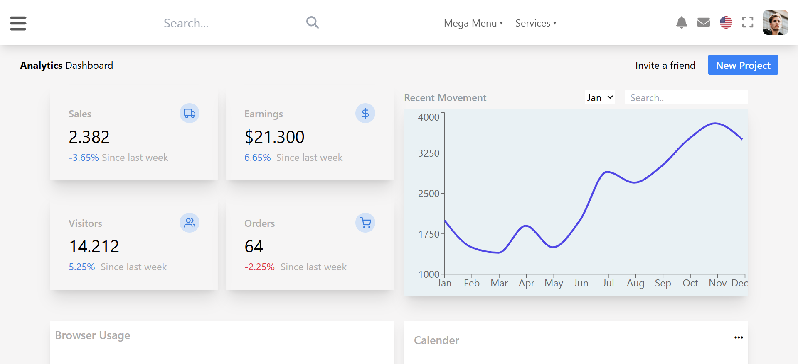

# 📊 Adminkit Dashboard Demo

A modern, responsive **Admin Dashboard UI** built with **React.js**, **Chart.js**, and **Tailwind CSS**. This project showcases data visualization and a sleek layout inspired by professional admin templates.

---

### 🧠 Tech Stack

- ⚛️ React.js  
- 🎨 Tailwind CSS  
- 📈 Chart.js

---

### 🚀 Features

✅ Fully responsive admin layout  
✅ Sidebar with navigation  
✅ Integrated charts with Chart.js  
✅ Modern UI components using Tailwind  
✅ Clean and modular code structure  
✅ Mobile-first responsive design  

---

🔗 Live Demo   https://adminkit-demo.vercel.app/

🛠️ Getting Started

📋 Prerequisites:
Node.js (v16+)
npm
Git

🧪 Installation:
git clone https://github.com/Zartasha-kanwal/Adminkit-demo.git
cd Adminkit-demo
npm install
npm start
